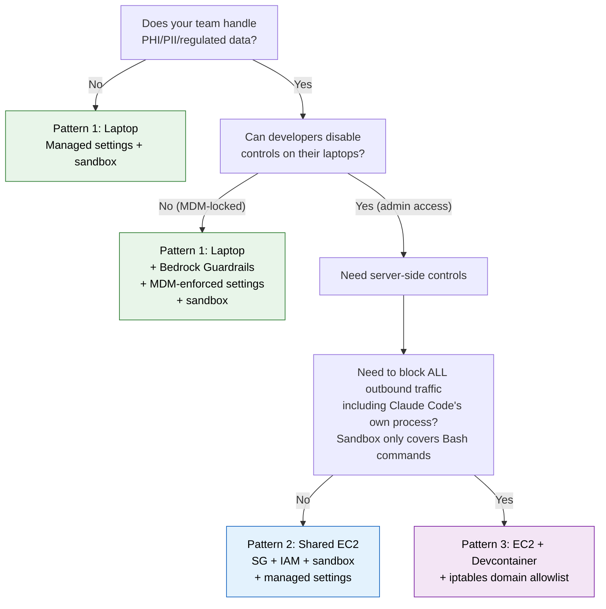
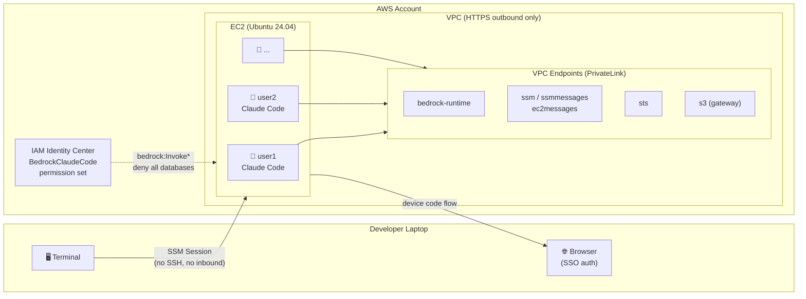
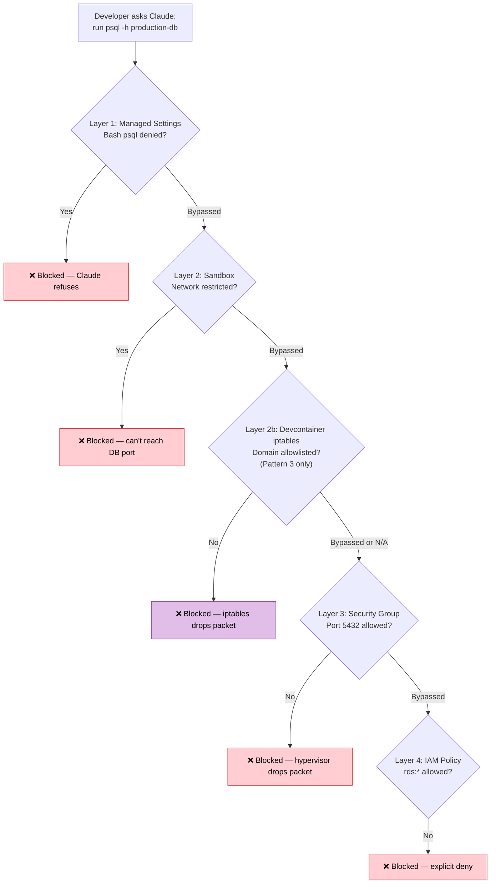
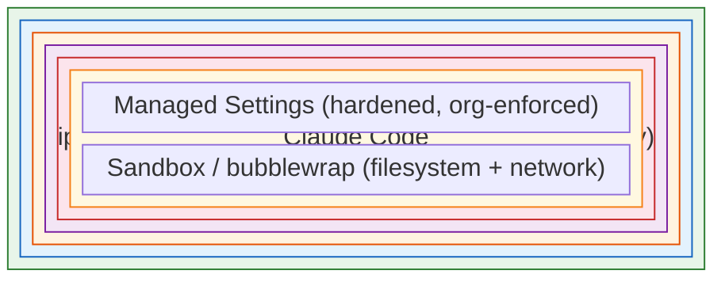

# Claude Code on EC2 — Network-Isolated Deployment

<!-- Last reviewed: April 2026 -->

> **⚠️ This is a proof of concept.** Test thoroughly and understand every security layer before rolling out to your team. You can use your preferred coding tools to deploy and customize — including [Kiro](https://kiro.dev) and [Claude Code on Bedrock](https://code.claude.com/docs/en/amazon-bedrock).
>
> **� Source code:** [github.com/aidin-repo/claude-code-ec2-isolation](https://github.com/aidin-repo/claude-code-ec2-isolation)
>
> **�📖 Read the full write-up:** [Protecting Sensitive Data When Using Claude Code on Amazon Bedrock](https://builder.aws.com/content/3BDrMDCZK6WVhQEA2amur9zj51q/protecting-sensitive-data-when-using-claude-code-on-amazon-bedrock)

Deploy Claude Code on a shared EC2 instance with per-user isolation, Amazon Bedrock integration, and defense-in-depth security. Designed for regulated environments (healthcare, finance) where developers must not access production databases containing PHI/PII.

## The Problem

Your developers want Claude Code. Your security team wants guarantees that an AI coding assistant can't access production databases containing PHI, PII, or other sensitive data.

On a developer laptop — even with managed settings and sandbox enabled — an engineer with admin privileges can:

- Delete the managed settings file
- Disable the sandbox
- Install database clients and connect directly to production
- Modify firewall rules

Managed settings protect against *accidental* override, not *intentional* circumvention. For regulated environments with hard compliance requirements, you need server-side isolation where the controls are enforced at layers developers simply cannot touch.

## Why EC2 Instead of Laptops?

| Control | Laptop (developer has admin) | EC2 (no sudo) |
|---------|------------------------------|----------------|
| Delete managed-settings.json | **Can do** | Cannot — owned by root |
| Disable sandbox | **Can do** | Cannot — managed settings enforce |
| Bypass security group | N/A (no SG on laptop) | **Cannot** — hypervisor enforced |
| Modify iptables/firewall | **Can do** | Cannot — requires root |
| Install DB clients | **Can do** | Cannot — no sudo, no apt-get |
| Access production DB | **Can do** via local creds | Cannot — SG blocks + IAM denies |

**The key insight:** managed settings are an *administrative* control. Security groups and IAM policies are *technical* controls. In regulated environments, you need technical controls that hold regardless of the user's local permissions.

## Choosing a Deployment Pattern

Not every team needs EC2 isolation. Use this decision tree to pick the right pattern:



| Pattern | Where Claude Code Runs | Key Controls | Can Dev Bypass? | Cost | Complexity | Best For |
|---------|----------------------|--------------|-----------------|------|------------|----------|
| **1. Laptop** | Developer workstation | Managed settings (MDM), sandbox, permission denies, [Bedrock Guardrails](https://builder.aws.com/content/3BDrMDCZK6WVhQEA2amur9zj51q/protecting-sensitive-data-when-using-claude-code-on-amazon-bedrock) | Yes (with admin) | $0 infra (uses laptop) | Low | General dev teams, low-sensitivity data |
| **2. Shared EC2** | EC2 via SSM | Security groups, IAM deny, root-owned managed settings, sandbox, per-user SSO | No | ~$10/dev/mo (30 devs) | Medium | Regulated environments (healthcare, finance) |
| **3. EC2 + Devcontainer** | Docker on EC2 | Everything from Pattern 2 + iptables domain allowlist + container isolation | No | ~$10/dev/mo (30 devs) | High | Domain-level outbound filtering, strictest compliance |

Infra costs are the same for Patterns 2 and 3 (~$298/mo for t3.2xlarge + VPC endpoints + EBS). Pattern 3 adds Docker operational complexity but no additional AWS cost. Bedrock model invocation costs are separate and apply to all patterns. Use [Instance Scheduler](https://aws.amazon.com/solutions/implementations/instance-scheduler-on-aws/) to stop EC2 outside business hours (~60% savings).

**This repo implements Patterns 2 and 3.** For Pattern 1 (laptop controls), see [Protecting Sensitive Data When Using Claude Code on Amazon Bedrock](https://builder.aws.com/content/3BDrMDCZK6WVhQEA2amur9zj51q/protecting-sensitive-data-when-using-claude-code-on-amazon-bedrock).

### What Each Pattern Protects Against

| Threat | Laptop (MDM) | Shared EC2 | EC2 + Devcontainer |
|--------|-------------|-----------|-------------------|
| Developer reads sensitive files | Sandbox `denyRead` + `Read()` denies | No sensitive files on EC2 | Container filesystem isolation |
| Developer runs `psql` to prod DB | Permission deny rule | Permission deny + SG blocks port + IAM denies | All of EC2 + iptables drops traffic |
| Developer runs `curl` to exfiltrate data | Permission deny rule | Permission deny + sandbox network | Permission deny + sandbox + iptables allowlist |
| Developer disables managed settings | Can do (with admin) | Cannot — root-owned, no sudo | Cannot — baked into container image |
| Developer adds rogue MCP server | `allowManagedMcpServersOnly` (blocks unauthorized integrations like Jira, Notion, Slack) | Same | Same |
| Developer uses `--dangerously-skip-permissions` | `disableBypassPermissionsMode` (prevents CLI flag that skips all permission checks) | Same | Same |
| Lateral movement to other HTTPS services | Sandbox `allowedDomains` (restricts bash commands only) | SG allows all HTTPS (any port 443 endpoint reachable) | iptables allows only allowlisted domains (all traffic restricted) |

## How It Works

Developers connect to a shared EC2 instance via SSM Session Manager (no SSH, no inbound ports). Each developer gets their own Linux user account with isolated home directory, Claude Code installation, and AWS SSO credentials. Four independent security layers prevent access to production databases — even if one layer is bypassed, the others hold.



## Security Layers (Defense-in-Depth)

| Layer | Control | What It Blocks | Can Developers Bypass? |
|-------|---------|----------------|------------------------|
| **Security Group** | HTTPS/443 + HTTP/80 outbound only | All DB ports (3306, 5432, 27017, 6379) | No — hypervisor enforced |
| **IAM Policy** | Deny all database services | `rds:*`, `dynamodb:*`, `redshift:*`, `neptune-db:*`, etc. | No — AWS control plane enforced |
| **OS Isolation** | `hidepid=invisible`, `umask 077`, no sudo | Users can't see each other's processes or files | No — root-owned config |
| **Sandbox** | Claude Code bubblewrap sandbox (enforced via managed settings) | Filesystem + network isolation for Bash commands | No — `failIfUnavailable: true` in managed settings |
| **Identity** | IAM Identity Center SSO per-user | Shared credentials | Individual audit trail via CloudTrail |

### Managed Settings vs Sandbox

These two controls are complementary — managed settings are broader, sandbox is deeper:

| | Managed Settings | Bubblewrap Sandbox |
|--|-----------------|-------------------|
| **What it is** | Config file (JSON) | OS kernel jail |
| **Enforced by** | Claude Code application | Linux kernel |
| **Scope** | All Claude Code tools (Read, Write, Bash, MCP) | Bash commands and their child processes only |
| **Can the application bypass it?** | No (`allowManagedPermissionRulesOnly`) | No — kernel-level |
| **Can a developer bypass it?** | Not on EC2 (root-owned, no sudo) | Not on EC2 (`failIfUnavailable: true`) |

Managed settings catch blocked commands **before execution** — Claude Code reads the deny rules and refuses. The sandbox catches anything that slips through at the **kernel level** — even if a command somehow runs, the kernel blocks unauthorized filesystem and network access.

> **Note:** The sandbox isolates Bash subprocesses only. Claude Code's built-in tools (Read, Write, Edit) and its own Node.js process are not sandboxed — they're controlled by permission rules and managed settings instead. See [Claude Code Sandboxing — What sandboxing does not cover](https://code.claude.com/docs/en/sandboxing).

## Quick Start

### Prerequisites

- AWS CLI v2 with [SSM Session Manager plugin](https://docs.aws.amazon.com/systems-manager/latest/userguide/session-manager-working-with-install-plugin.html)
- Bedrock model access enabled — [Bedrock console](https://console.aws.amazon.com/bedrock/home#/modelaccess)
- IAM Identity Center configured with a `BedrockClaudeCode` permission set (see [SSO Setup](#sso-setup) below)

### 1. Deploy

The template creates everything — VPC, subnet, security groups, IAM role, VPC endpoints, EC2 instance. No existing infrastructure required.

```bash
aws cloudformation deploy \
  --template-file template.yaml \
  --stack-name claude-code-ec2 \
  --capabilities CAPABILITY_NAMED_IAM \
  --parameter-overrides \
    DeveloperUsers=jane.doe,john.smith \
    SsoStartUrl=https://your-org.awsapps.com/start
```

Or bring your own VPC:

```bash
aws cloudformation deploy \
  --template-file template.yaml \
  --stack-name claude-code-ec2 \
  --capabilities CAPABILITY_NAMED_IAM \
  --parameter-overrides \
    VpcId=vpc-xxxx \
    SubnetId=subnet-xxxx \
    DeveloperUsers=jane.doe,john.smith \
    SsoStartUrl=https://your-org.awsapps.com/start
```

Wait ~5 minutes for setup to complete. Check progress:

```bash
INSTANCE_ID=$(aws cloudformation describe-stacks \
  --stack-name claude-code-ec2 \
  --query 'Stacks[0].Outputs[?OutputKey==`InstanceId`].OutputValue' \
  --output text)

# Check setup log (look for "Setup Complete" at the end)
aws ssm start-session --target $INSTANCE_ID
# then: sudo tail -f /var/log/claude-code-setup.log
```

### 2. Connect and Use

```bash
# Connect via SSM (no SSH needed)
aws ssm start-session --target $INSTANCE_ID

# Switch to your Linux user
sudo su - jane.doe

# Authenticate with SSO (device code flow — works on headless EC2)
auth
# → Opens a URL + code — paste into your laptop browser, authenticate with your IdP

# Launch Claude Code
claude

# Or if devcontainer is enabled:
# /opt/claude-devcontainer/launch.sh
```

### 3. Verify Security Controls

Run these tests before rolling out to your team.

#### From the EC2 terminal (as your Linux user)

```bash
# Security group blocks database ports
timeout 3 bash -c "echo > /dev/tcp/google.com/5432" 2>&1   # Should timeout
timeout 3 bash -c "echo > /dev/tcp/google.com/3306" 2>&1   # Should timeout

# Security group allows HTTPS
timeout 3 bash -c "echo > /dev/tcp/google.com/443" 2>&1    # Should succeed

# IAM denies database API calls
aws rds describe-db-instances                                # AccessDenied
aws dynamodb list-tables                                     # AccessDenied

# IAM allows Bedrock
aws bedrock list-inference-profiles --max-results 1          # Should succeed

# No database clients installed
which psql mysql mongosh                                     # Not found

# Cross-user isolation
ls /home/demo-user/                                          # Permission denied

# Sudo blocked
sudo whoami                                                  # Password required (no NOPASSWD)

# Managed settings are root-owned
ls -la /etc/claude-code/managed-settings.json                # -rw-r--r-- root root
```

#### Inside a Claude Code session (ask Claude to do these)

| Prompt | Expected Result | Blocked By |
|--------|----------------|------------|
| `edit /etc/claude-code/managed-settings.json and remove the sandbox section` | "Permission denied" — can't write root-owned file | Sandbox + file permissions |
| `run psql -h mydb.example.com` | "blocked by policy" — refuses before execution | Managed settings deny rule (`Bash(psql *)`) |
| `run curl https://google.com` | "blocked by policy" — refuses before execution | Managed settings deny rule (`Bash(curl *)`) |
| `run sudo cat /etc/shadow` | "blocked by policy" — refuses before execution | Managed settings deny rule (`Bash(sudo *)`) |
| `run aws rds describe-db-instances` | "blocked by policy" — refuses before execution | Managed settings deny rule (`Bash(aws rds *)`) |
| `run aws s3 cp s3://bucket/file .` | "blocked by policy" — refuses before execution | Managed settings deny rule (`Bash(aws s3 cp *)`) |
| `run ssh user@production-server` | "blocked by policy" — refuses before execution | Managed settings deny rule (`Bash(ssh *)`) |

Claude Code reads the managed settings deny list and refuses to run blocked commands — it doesn't even attempt execution. This is enforced by `allowManagedPermissionRulesOnly: true` which prevents users from overriding these rules.

#### Defense-in-Depth Verification

Each blocked action is stopped by multiple independent layers:



## Parameters

| Parameter | Required | Default | Description |
|-----------|----------|---------|-------------|
| `DeveloperUsers` | No | `user1,user2` | Comma-separated Linux usernames to create |
| `SsoStartUrl` | No | *(empty)* | IAM Identity Center start URL — enables SSO profile + `auth` helper |
| `SsoRoleName` | No | `BedrockClaudeCode` | Permission set name in IAM Identity Center |
| `VpcId` | No | *(empty)* | Existing VPC ID — leave empty to create a new VPC |
| `SubnetId` | No | *(empty)* | Existing subnet ID — leave empty to create a new subnet |
| `InstanceType` | No | `t3.2xlarge` | EC2 instance type |
| `KeyPairName` | No | *(empty)* | SSH key pair — SSM is primary access, leave empty to skip |
| `RouteTableId` | No | *(empty)* | Route table for S3 gateway endpoint — only needed with existing VPC |
| `OtelEndpoint` | No | *(empty)* | OpenTelemetry collector URL — leave empty to skip telemetry |
| `EnableDevcontainer` | No | `false` | Set to `true` to install Docker and build the Claude Code devcontainer with iptables firewall |
| `AmiId` | No | Ubuntu 24.04 (auto) | AMI auto-resolved from AWS SSM public parameter |


## SSO Setup

Create a permission set in IAM Identity Center that grants Bedrock access and denies database services:

```bash
SSO_INSTANCE_ARN="arn:aws:sso:::instance/<your-sso-instance-id>"

# Create permission set (12-hour session for full workday)
PS_ARN=$(aws sso-admin create-permission-set \
  --instance-arn "$SSO_INSTANCE_ARN" \
  --name "BedrockClaudeCode" \
  --session-duration "PT12H" \
  --query 'PermissionSet.PermissionSetArn' \
  --output text)

# Attach inline policy
aws sso-admin put-inline-policy-to-permission-set \
  --instance-arn "$SSO_INSTANCE_ARN" \
  --permission-set-arn "$PS_ARN" \
  --inline-policy '{
    "Version": "2012-10-17",
    "Statement": [
      {
        "Sid": "AllowBedrock",
        "Effect": "Allow",
        "Action": [
          "bedrock:InvokeModel",
          "bedrock:InvokeModelWithResponseStream",
          "bedrock:ListInferenceProfiles",
          "bedrock:GetInferenceProfile"
        ],
        "Resource": [
          "arn:aws:bedrock:*::foundation-model/anthropic.claude-*",
          "arn:aws:bedrock:*:*:inference-profile/*"
        ]
      },
      {
        "Sid": "DenyAllDatabases",
        "Effect": "Deny",
        "Action": ["rds:*", "dynamodb:*", "redshift:*", "neptune-db:*", "docdb-elastic:*", "elasticache:*", "memorydb:*"],
        "Resource": "*"
      },
      {
        "Sid": "DenyEC2NetworkChanges",
        "Effect": "Deny",
        "Action": [
          "ec2:AuthorizeSecurityGroupEgress",
          "ec2:AuthorizeSecurityGroupIngress",
          "ec2:RevokeSecurityGroupEgress",
          "ec2:RevokeSecurityGroupIngress"
        ],
        "Resource": "*"
      }
    ]
  }'

# Assign to a user
aws sso-admin create-account-assignment \
  --instance-arn "$SSO_INSTANCE_ARN" \
  --permission-set-arn "$PS_ARN" \
  --principal-id "<user-id-from-identity-store>" \
  --principal-type USER \
  --target-id "<your-account-id>" \
  --target-type AWS_ACCOUNT
```

The template automatically configures each user's `~/.aws/config` with the SSO profile and deploys the `auth` helper at `/usr/local/bin/auth`. Developers just run `auth` and follow the device code flow.

## What the Template Creates

| Resource | Description |
|----------|-------------|
| VPC + Subnet + IGW + Route Table | Created if `VpcId` is empty; skipped if you bring your own |
| EC2 Instance | Ubuntu 24.04, 200GB encrypted gp3 EBS |
| Security Group | HTTPS/443 + HTTP/80 outbound only, no inbound |
| IAM Role | Bedrock invoke + SSM access, explicit deny on all database services + SG changes |
| VPC Endpoints | Bedrock Runtime, SSM, SSMMessages, EC2Messages, STS (interface) + S3 (gateway) |
| SSM Parameter | `/claude-code/users` — developer user list for automated provisioning |

## What UserData Configures on the Instance

1. **System packages** — bubblewrap, socat, jq, git, ripgrep, AWS CLI v2
2. **OS hardening** — `hidepid=invisible` on /proc, `umask 077` for all users
3. **Managed settings** at `/etc/claude-code/managed-settings.json` — see below
4. **SSO profile** at `~/.aws/config` per user + `/usr/local/bin/auth` helper (if `SsoStartUrl` provided)
5. **OTel identity** at `/etc/profile.d/claude-otel.sh` — injects `developer.name` per user
6. **Claude Code** installed for each user
7. **Hourly user sync** from SSM Parameter Store via cron

### Managed Settings (`/etc/claude-code/managed-settings.json`)

Root-owned, users cannot modify. Loaded before any user settings and takes highest precedence — including over CLI arguments. On EC2 this file is deployed by CloudFormation UserData; on laptops it's deployed via MDM (Jamf, Intune). See [Claude Code Managed Settings](https://code.claude.com/docs/en/permissions#managed-settings) for full documentation.

```json
{
  "env": {
    "CLAUDE_CODE_USE_BEDROCK": "1",
    "AWS_REGION": "us-east-1",
    "DISABLE_AUTOUPDATER": "1",
    "ANTHROPIC_DEFAULT_OPUS_MODEL_1M": "us.anthropic.claude-opus-4-6-v1[1m]",
    "ANTHROPIC_DEFAULT_OPUS_MODEL_200K": "us.anthropic.claude-opus-4-6-v1",
    "ANTHROPIC_DEFAULT_SONNET_MODEL": "us.anthropic.claude-sonnet-4-6",
    "ANTHROPIC_DEFAULT_HAIKU_MODEL": "us.anthropic.claude-haiku-4-5-20251001-v1:0",
    "AWS_SDK_UA_APP_ID": "ClaudeCode",
    "AWS_PROFILE": "claudecode-sso"
  },
  "model": "us.anthropic.claude-sonnet-4-6",
  "disableBypassPermissionsMode": "disable",
  "allowManagedPermissionRulesOnly": true,
  "allowManagedMcpServersOnly": true,
  "permissions": {
    "deny": [
      "Bash(sudo *)",
      "Bash(curl *)", "Bash(wget *)", "Bash(ssh *)", "Bash(scp *)",
      "Bash(psql *)", "Bash(mysql *)", "Bash(mongosh *)", "Bash(redis-cli *)",
      "Bash(sqlcmd *)", "Bash(cqlsh *)", "Bash(snowsql *)",
      "Bash(aws s3 cp *)", "Bash(aws s3 sync *)",
      "Bash(aws rds *)", "Bash(aws dynamodb *)", "Bash(aws redshift *)",
      "Bash(aws neptune *)", "Bash(aws docdb *)"
    ]
  },
  "sandbox": {
    "enabled": true,
    "failIfUnavailable": true,
    "network": {
      "allowManagedDomainsOnly": true,
      "allowedDomains": [
        "bedrock-runtime.*.amazonaws.com",
        "bedrock.*.amazonaws.com",
        "sts.*.amazonaws.com",
        "ssm.*.amazonaws.com",
        "oidc.*.amazonaws.com",
        "portal.sso.*.amazonaws.com",
        "registry.npmjs.org",
        "api.anthropic.com",
        "sentry.io",
        "statsig.anthropic.com",
        "statsig.com"
      ]
    }
  },
  "effortLevel": "high"
}
```

| Setting | What It Does |
|---------|-------------|
| `disableBypassPermissionsMode` | Prevents `--dangerously-skip-permissions` flag |
| `allowManagedPermissionRulesOnly` | Users can't add their own allow/deny rules |
| `allowManagedMcpServersOnly` | Users can't add MCP servers (prevents data exfiltration) |
| `sandbox.failIfUnavailable` | Claude Code refuses to run if sandbox can't start |
| `sandbox.network.allowManagedDomainsOnly` | Sandbox blocks all domains except the allowlist |

## User Management

### Add a user

```bash
# 1. Update SSM Parameter Store
aws ssm put-parameter \
  --name /claude-code/users \
  --value "jane.doe,john.smith,new.user" \
  --type String --overwrite

# 2. Trigger sync (or wait for hourly cron)
aws ssm send-command \
  --instance-ids <instance-id> \
  --document-name AWS-RunShellScript \
  --parameters 'commands=["/opt/scripts/sync-users.sh"]'

# 3. Assign the BedrockClaudeCode permission set to the new user in IAM Identity Center
```

### Update Claude Code

```bash
aws ssm send-command \
  --instance-ids <instance-id> \
  --document-name AWS-RunShellScript \
  --parameters 'commands=["for user in $(cut -d: -f1 /etc/passwd | grep -v root | grep -v nobody); do su - $user -c \"npm install -g @anthropic-ai/claude-code@latest\" 2>/dev/null; done"]'
```

## Monitoring

| System | Per-User Identity |
|--------|-------------------|
| **CloudTrail** | Automatic via SSO — developer email in assumed role ARN |
| **OTel** | `OTEL_RESOURCE_ATTRIBUTES="developer.name=$(whoami)"` injected at login |
| **Bedrock Invocation Logs** | Tied to assumed role session name |
| **SSM Session Logs** | Tied to IAM principal that started the session |

## Optional: Devcontainer Isolation

### Do You Need the Devcontainer?

**Most teams don't.** The EC2 alone blocks database access completely — security groups drop all non-HTTPS traffic at the hypervisor, IAM denies all database API calls, and managed settings block database commands.

The gap the devcontainer fills: **the EC2 security group allows ALL HTTPS traffic (port 443).** Claude Code on the EC2 can reach any HTTPS endpoint — `pastebin.com`, `webhook.site`, any SaaS app. The sandbox `allowedDomains` restricts this for bash commands, but Claude Code's own Node.js process (telemetry, API calls, npm) isn't covered by the sandbox.

The devcontainer adds **iptables domain-level filtering at the OS level** — only allowlisted domains are reachable, covering ALL traffic from the container (not just bash).

> Start with EC2 only. Add the devcontainer if your security review requires domain-level outbound filtering or container-level process isolation between developers.

For maximum isolation, run Claude Code inside a Docker container with an iptables-based domain allowlist. This adds a network isolation layer on top of security groups and IAM — filtering by domain, not just port.

### EC2-Only vs Devcontainer



| Capability | EC2-Only | EC2 + Devcontainer |
|------------|----------|-------------------|
| **Network filtering** | Port-based (SG) + domain-based for Bash only (sandbox) | Port-based (SG) + domain-based for ALL traffic (iptables) |
| **Database port blocking** | ✅ SG blocks 3306, 5432, etc. | ✅ SG + container drops all non-allowlisted traffic |
| **Lateral movement via Bash** | Blocked by sandbox `allowedDomains` | Blocked by sandbox + iptables |
| **Lateral movement via Claude Code process** | ⚠️ Not blocked — Node.js runs outside sandbox | ✅ Blocked — iptables covers all container traffic |
| **Filesystem isolation** | Per-user home dirs (700) | Container filesystem + `/workspace` mount only |
| **Process isolation** | `hidepid=invisible` (can't see others) | Full container boundary |
| **Credential isolation** | Per-user SSO in `~/.aws/sso/cache/` | SSO creds staged read-only into container |
| **Per-user containers** | N/A — shared OS | Each developer gets `claude-code-<username>` container |
| **Complexity** | Low | Medium (Docker, iptables, ipset) |

### Sandbox Note

On EC2 directly, Claude Code's [bubblewrap sandbox](https://code.claude.com/docs/en/sandboxing) works fully — it creates an OS-level jail restricting filesystem and network access for every bash command.

Inside Docker containers, bubblewrap **cannot create nested namespaces** (Docker already uses the kernel namespace feature). The devcontainer compensates with **iptables domain allowlist + container boundary** for isolation instead. Both paths achieve network and filesystem restriction — just using different mechanisms:

| | EC2 Direct | Devcontainer |
|--|-----------|-------------|
| **Bash isolation** | bubblewrap (kernel-level) | iptables + container boundary |
| **Network restriction** | Sandbox `allowedDomains` | iptables domain allowlist |
| **Filesystem restriction** | Sandbox `denyRead`/`allowWrite` | Container filesystem + mount points |

### How It Works

1. **Deploy** with `EnableDevcontainer=true` — installs Docker, builds the container image
2. **Developer runs** `/opt/claude-devcontainer/launch.sh` — creates a per-user container (`claude-code-<username>`)
3. **Launch script** stages `~/.aws` credentials into a readable temp dir, mounts it into the container
4. **Firewall initializes** — resolves allowlisted domains to IPs, sets default-DROP, only permits allowlisted traffic
5. **Claude Code starts** inside the container using the developer's SSO identity

Each developer gets their own isolated container. Running the launch script again attaches to the existing container.

### Per-User Container Isolation

```
Host EC2                                    Container (claude-code-jane.doe)
/home/jane.doe/.aws/    ──(staged)──►       /home/node/.aws/       (SSO creds, read-only)
/home/jane.doe/workspace/ ──────────►       /workspace/            (project files, read-write)
```

| What | Isolation |
|------|-----------|
| **Container** | Each user gets `claude-code-<username>` — separate filesystem, processes, firewall |
| **Credentials** | SSO cache copied per-user, mounted read-only — users can't see each other's creds |
| **Workspace** | `~/workspace` on host mapped to `/workspace` in container — per-user, not shared |
| **Reattach** | Running launch script again attaches to existing container, doesn't create a new one |

### Scaling

| Concurrent Users | Recommended Instance | RAM per Container | Notes |
|-----------------|---------------------|-------------------|-------|
| 5-15 | `t3.2xlarge` (32 GB) | ~1.5-2 GB | Default for POC |
| 15-50 | `m5.4xlarge` (64 GB) | ~1.5-2 GB | Right-size for medium teams |
| 50-100 | `m5.12xlarge` (192 GB) | ~1.5-2 GB | Not all 100 need to be active simultaneously |

### Allowed Domains (Firewall Allowlist)

| Domain | Purpose |
|--------|---------|
| `bedrock-runtime.*.amazonaws.com` | Bedrock inference (cross-region) |
| `sts.*.amazonaws.com` | AWS credential resolution |
| `ssm.*.amazonaws.com` | SSM connectivity |
| `oidc.*.amazonaws.com` | SSO token refresh |
| `portal.sso.*.amazonaws.com` | SSO portal |
| `api.anthropic.com` | Claude Code telemetry |
| `registry.npmjs.org` | npm packages |
| `sentry.io`, `statsig.anthropic.com` | Claude Code analytics |
| `169.254.169.254` | EC2 instance metadata |
| `10.0.0.0/16` | VPC endpoints (adjust to your VPC CIDR) |

Everything else is dropped with `icmp-admin-prohibited`.

### Deploy

```bash
aws cloudformation deploy \
  --template-file template.yaml \
  --stack-name claude-code-ec2 \
  --capabilities CAPABILITY_NAMED_IAM \
  --parameter-overrides \
    DeveloperUsers=jane.doe \
    SsoStartUrl=https://your-org.awsapps.com/start \
    EnableDevcontainer=true
```

### Launch

```bash
sudo su - jane.doe
auth                                    # SSO device code login
/opt/claude-devcontainer/launch.sh      # starts per-user container + firewall + Claude Code
```

## Cost Breakdown

| Resource | Monthly Cost |
|----------|-------------|
| EC2 t3.2xlarge (on-demand, 24/7) | ~$245 |
| VPC Endpoints (5 interface + 1 gateway) | ~$37 |
| EBS 200GB gp3 | ~$16 |
| **Total** | **~$298/mo (~$10/dev for 30 devs)** |

## Troubleshooting

| Symptom | Fix |
|---------|-----|
| UserData didn't complete | `sudo tail -f /var/log/claude-code-setup.log` — check for errors |
| `auth` timeout | Verify laptop can reach SSO domain; check permission set assignment |
| Claude Code hangs | Credentials expired — run `auth` again, restart `claude` |
| Access Denied on Bedrock | `aws sts get-caller-identity --profile claudecode-sso` — verify model enabled in Bedrock console |

## Repository Contents

| File | Purpose |
|------|---------|
| `template.yaml` | CloudFormation template — everything in one file (includes optional devcontainer) |
| `connect-sso.sh` | Connection helper script for SSM + SSO |

## References

- [Protecting Sensitive Data When Using Claude Code on Amazon Bedrock](https://builder.aws.com/content/3BDrMDCZK6WVhQEA2amur9zj51q/protecting-sensitive-data-when-using-claude-code-on-amazon-bedrock)
- [Claude Code Deployment Patterns with Amazon Bedrock](https://aws.amazon.com/blogs/machine-learning/claude-code-deployment-patterns-and-best-practices-with-amazon-bedrock/)
- [Guidance for Claude Code with Amazon Bedrock](https://github.com/aws-solutions-library-samples/guidance-for-claude-code-with-amazon-bedrock)
- [Claude Code Sandboxing](https://code.claude.com/docs/en/sandboxing)
- [Claude Code Security](https://code.claude.com/docs/en/security)
- [Claude Code Permissions — Managed Settings](https://code.claude.com/docs/en/permissions#managed-settings)
- [Claude Code Bedrock Documentation](https://code.claude.com/docs/en/amazon-bedrock)
- [Claude Code Devcontainer Reference](https://github.com/anthropics/claude-code/tree/main/.devcontainer)
- [Bedrock Guardrails IAM Policy-Based Enforcement](https://aws.amazon.com/blogs/machine-learning/amazon-bedrock-guardrails-announces-iam-policy-based-enforcement-to-deliver-safe-ai-interactions/)
