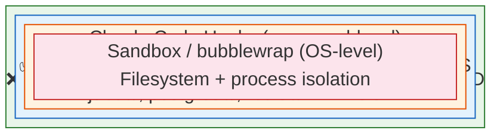
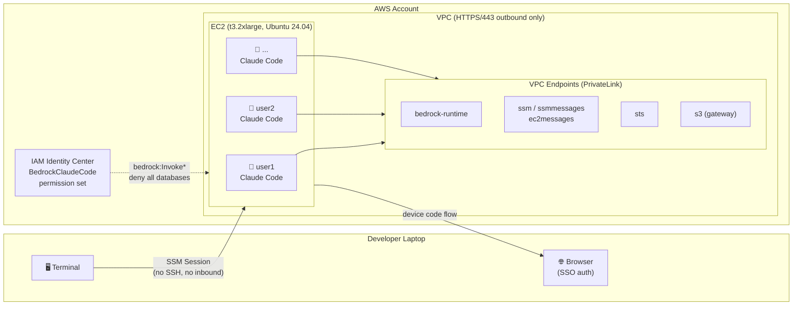
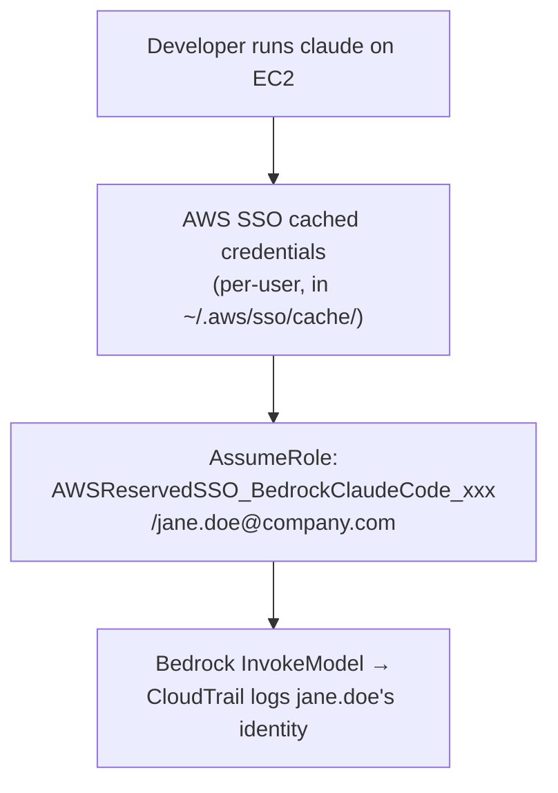
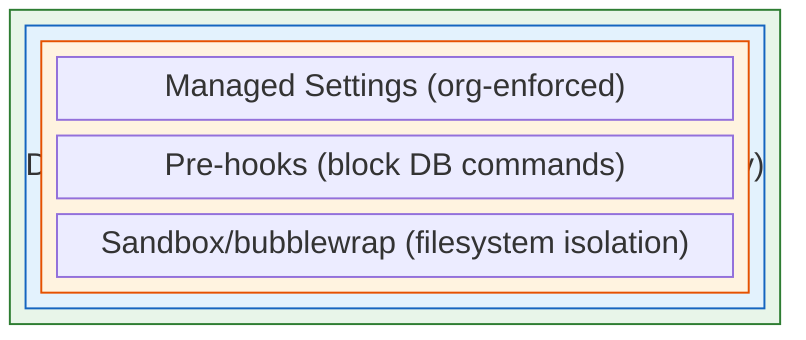

# Claude Code on EC2: Network Isolation for Regulated Environments

*How to deploy Claude Code on a shared Amazon EC2 instance with defense-in-depth security, per-user identity, and Amazon Bedrock — designed for healthcare, finance, and other regulated industries.*

---

## The Problem

Your developers want Claude Code. Your security team wants guarantees that an AI coding assistant can't access production databases containing PHI, PII, or other sensitive data.

On a developer laptop — even with managed settings and sandbox enabled — an engineer with admin privileges can:

- Delete the managed settings file
- Disable the sandbox
- Install database clients and connect directly to production
- Modify firewall rules

Managed settings protect against *accidental* override, not *intentional* circumvention. For regulated environments with hard compliance requirements, you need server-side isolation where the controls are enforced at layers developers simply cannot touch.

## The Solution: Shared EC2 with Defense-in-Depth

A single EC2 instance shared by your development team, locked down with four independent security layers:



Each layer operates independently. Even if one is bypassed, the others hold:

| Layer | Enforced By | Can Developers Bypass? |
|-------|-------------|------------------------|
| **Security Group** | AWS hypervisor | No — not even root on the instance |
| **IAM Policy** | AWS control plane | No — enforced server-side by AWS |
| **Pre-hooks** | Claude Code runtime | Soft guard — bypassable with obfuscation, but SG + IAM are the hard controls |
| **Sandbox** | OS (bubblewrap) | Cannot disable — enforced by managed-settings.json (root-owned) |

## Why Not Just Lock Down Laptops?

This is the most common question from engineering teams evaluating this pattern:

| Control | Laptop (developer has admin) | EC2 (no sudo) |
|---------|------------------------------|----------------|
| Delete managed-settings.json | **Can do** | Cannot — owned by root |
| Disable sandbox | **Can do** | Cannot — managed settings enforce |
| Bypass security group | N/A (no SG on laptop) | **Cannot** — hypervisor enforced |
| Modify iptables/firewall | **Can do** | Cannot — requires root |
| Install DB clients | **Can do** | Cannot — no sudo, no apt-get |
| Access production DB | **Can do** via local creds | Cannot — SG blocks + IAM denies |

> *"On a local machine... no sandbox, no abstractions, direct access. Local machines cannot simultaneously provide necessary access while maintaining governance controls."*
> — [Coder: Every Cursor Needs a Coder](https://coder.com/blog/every-cursor-needs-a-coder)

**The key insight:** managed settings are an *administrative* control. Security groups and IAM policies are *technical* controls. In regulated environments, you need technical controls that hold regardless of the user's local permissions.

---

## Architecture



### What CloudFormation Creates

| Resource | Purpose |
|----------|---------|
| EC2 Instance | t3.2xlarge, Ubuntu 24.04, 200GB encrypted gp3 |
| Security Group | HTTPS/443 outbound only, no inbound |
| IAM Role | `ClaudeCodeEC2Role` — Bedrock + SSM, deny databases + deny SG changes |
| VPC Endpoints | Bedrock Runtime, SSM, SSMMessages, EC2Messages, STS (interface) + S3 (gateway) |
| SSM Parameter | `/claude-code/users` — developer user list for automated provisioning |

---

## Prerequisites

Before starting, ensure you have:

- **AWS CLI v2** (v2.22+ for `--use-device-code` support)
- **SSM Session Manager plugin** — [install guide](https://docs.aws.amazon.com/systems-manager/latest/userguide/session-manager-working-with-install-plugin.html)
- **VPC** with `enableDnsHostnames` and `enableDnsSupport` set to true
- **Private subnet** with a route table ID (or public subnet for initial testing)
- **Bedrock model access** — enable Claude models in the [Bedrock console](https://console.aws.amazon.com/bedrock/home#/modelaccess) (Model access page)
- **SSH key pair** (optional) — SSM is the primary access method; only needed for emergency SSH access

## Step 1: Deploy the CloudFormation Stack

```bash
# Deploy (only VpcId and SubnetId are required — AMI auto-resolves from SSM)
aws cloudformation deploy \
  --template-file template.yaml \
  --stack-name claude-code-ec2 \
  --capabilities CAPABILITY_NAMED_IAM \
  --parameter-overrides \
    VpcId=vpc-xxxx \
    SubnetId=subnet-xxxx \
    DeveloperUsers=jane.doe,john.smith
```

> **Note:** The AMI is auto-resolved to the latest Ubuntu 24.04 via AWS SSM public parameter. `OtelEndpoint` and `KeyPairName` are optional — omit them and telemetry/SSH will be skipped. If your VPC doesn't have an S3 gateway endpoint, pass `RouteTableId=rtb-xxxx` to create one.

Wait ~5 minutes for UserData to complete. Check progress: `sudo tail -f /var/log/claude-code-setup.log` — look for "Setup Complete" at the end. The script:

1. Installs packages: `bubblewrap`, `socat`, `jq`, `git`, `ripgrep`, AWS CLI v2
2. Hardens the OS: `hidepid=invisible` on `/proc`, `umask 077` for all users
3. Deploys **managed settings** to `/etc/claude-code/managed-settings.json` — Bedrock config, OTel, deny sudo (cannot be overridden by users)
4. Deploys **pre-hook** to `/opt/claude-hooks/block-db-access.sh` — blocks database clients, connection strings, and AWS database CLI commands
5. Injects **OTel per-user identity** at `/etc/profile.d/claude-otel.sh`
6. Creates Linux users with isolated home directories and per-user Claude Code settings
7. Installs Claude Code for each user
8. Sets up hourly **user sync** from SSM Parameter Store

### Verify

```bash
INSTANCE_ID=$(aws cloudformation describe-stacks \
  --stack-name claude-code-ec2 \
  --query 'Stacks[0].Outputs[?OutputKey==`InstanceId`].OutputValue' \
  --output text)

aws ssm start-session --target $INSTANCE_ID

# On the instance:
sudo cat /var/log/claude-code-setup.log    # Check for errors
sudo su - jane.doe && claude --version     # Verify Claude Code
```

---

## Step 2: Configure IAM Identity Center

Create a permission set that grants Bedrock access and explicitly denies database services.

```bash
SSO_INSTANCE_ARN="arn:aws:sso:::instance/<your-sso-instance-id>"

# Create permission set (12-hour session for full workday)
PS_ARN=$(aws sso-admin create-permission-set \
  --instance-arn "$SSO_INSTANCE_ARN" \
  --name "BedrockClaudeCode" \
  --description "Bedrock access for Claude Code — deny all databases" \
  --session-duration "PT12H" \
  --query 'PermissionSet.PermissionSetArn' \
  --output text)

# Attach inline policy
aws sso-admin put-inline-policy-to-permission-set \
  --instance-arn "$SSO_INSTANCE_ARN" \
  --permission-set-arn "$PS_ARN" \
  --inline-policy '{
    "Version": "2012-10-17",
    "Statement": [
      {
        "Sid": "AllowBedrock",
        "Effect": "Allow",
        "Action": [
          "bedrock:InvokeModel",
          "bedrock:InvokeModelWithResponseStream",
          "bedrock:ListInferenceProfiles"
        ],
        "Resource": [
          "arn:aws:bedrock:us-east-1::foundation-model/anthropic.claude-*",
          "arn:aws:bedrock:us-east-1:<your-account-id>:inference-profile/*"
        ]
      },
      {
        "Sid": "DenyAllDatabases",
        "Effect": "Deny",
        "Action": [
          "rds:*", "dynamodb:*", "redshift:*",
          "neptune-db:*", "docdb-elastic:*",
          "elasticache:*", "memorydb:*"
        ],
        "Resource": "*"
      },
      {
        "Sid": "DenyEC2NetworkChanges",
        "Effect": "Deny",
        "Action": [
          "ec2:AuthorizeSecurityGroupEgress",
          "ec2:AuthorizeSecurityGroupIngress",
          "ec2:RevokeSecurityGroupEgress",
          "ec2:RevokeSecurityGroupIngress"
        ],
        "Resource": "*"
      }
    ]
  }'

# Assign to a user
ACCOUNT_ID=$(aws sts get-caller-identity --query Account --output text)

USER_ID=$(aws identitystore list-users \
  --identity-store-id <identity-store-id> \
  --filters AttributePath=UserName,AttributeValue=jane.doe@company.com \
  --query 'Users[0].UserId' --output text)

aws sso-admin create-account-assignment \
  --instance-arn "$SSO_INSTANCE_ARN" \
  --permission-set-arn "$PS_ARN" \
  --principal-id "$USER_ID" \
  --principal-type USER \
  --target-id "$ACCOUNT_ID" \
  --target-type AWS_ACCOUNT
```

---

## Step 3: Configure AWS CLI on EC2

SSH or SSM into the instance and deploy this to each user's `~/.aws/config`:

```ini
[profile claudecode-sso]
sso_session = claudecode
sso_account_id = <your-account-id>
sso_role_name = BedrockClaudeCode
region = us-east-1

[sso-session claudecode]
sso_start_url = https://<your-sso-domain>.awsapps.com/start
sso_region = us-east-1
sso_registration_scopes = sso:account:access
```

And create the `auth` helper at `/usr/local/bin/auth`:

```bash
#!/bin/bash
aws sso login --profile claudecode-sso --use-device-code
```

---

## Step 4: Connect and Test

```bash
# From your laptop — connect via SSM (no SSH, no inbound ports needed)
aws ssm start-session --target $INSTANCE_ID

# On the EC2 instance
sudo su - jane.doe

# Authenticate with SSO (device code flow — works on headless EC2)
auth
# → Prints: Open https://device.sso.us-east-1.amazonaws.com/
# → Prints: Code: ABCD-EFGH
# → Open URL on laptop browser, enter code, authenticate with IdP

# Verify credentials
aws sts get-caller-identity --profile claudecode-sso
# → arn:aws:sts::<account>:assumed-role/.../jane.doe@company.com

# Launch Claude Code
claude
```

### Test Security Controls

```bash
# Security group blocks database ports
nc -zv <rds-endpoint> 5432             # Should timeout

# IAM denies database API calls
aws rds describe-db-instances           # Should return AccessDenied

# Hook blocks database commands (inside Claude Code session)
# Ask Claude to run: psql -h mydb.example.com
# → Blocked: "Database client connections are blocked by policy"
```

---

## Per-User Identity and Monitoring

Every developer authenticates individually. No shared credentials, no generic instance role for user-facing operations.



### What Gets Logged

**CloudTrail** (automatic) — every Bedrock call includes the developer's email:

```json
{
  "userIdentity": {
    "arn": "arn:aws:sts::123456789012:assumed-role/AWSReservedSSO_BedrockClaudeCode_abc123/jane.doe@company.com"
  },
  "eventName": "InvokeModelWithResponseStream"
}
```

**OpenTelemetry** (built-in) — Claude Code emits metrics natively:

| Metric | What It Tracks |
|--------|---------------|
| `claude_code.cost.usage` | USD cost by model |
| `claude_code.token.usage` | Tokens by type (input/output/cache) |
| `claude_code.session.count` | Session starts |
| `claude_code.lines_of_code.count` | Lines modified |

Per-user identity is injected via `/etc/profile.d/claude-otel.sh`:

```bash
export OTEL_RESOURCE_ATTRIBUTES="developer.name=$(whoami),developer.email=$(whoami)@company.com"
```

**Bedrock Invocation Logging** — enable in the Bedrock console for full request/response bodies, tied to the assumed role session.

### Enable CloudTrail Data Events

```bash
aws cloudtrail put-event-selectors \
  --trail-name <your-trail> \
  --advanced-event-selectors '[{
    "Name": "BedrockInvocations",
    "FieldSelectors": [
      {"Field": "eventCategory", "Equals": ["Data"]},
      {"Field": "resources.type", "Equals": ["AWS::Bedrock::Model"]}
    ]
  }]'
```

---

## Day-2 Operations

### Add a user

```bash
# Update SSM Parameter Store
aws ssm put-parameter \
  --name /claude-code/users \
  --value "jane.doe,john.smith,new.user" \
  --type String --overwrite

# Trigger sync (or wait for hourly cron)
aws ssm send-command \
  --instance-ids $INSTANCE_ID \
  --document-name AWS-RunShellScript \
  --parameters 'commands=["/opt/scripts/sync-users.sh"]'

# Assign IAM Identity Center permission set to the new user (Step 2)
```

### Update Claude Code version

```bash
aws ssm send-command \
  --instance-ids $INSTANCE_ID \
  --document-name AWS-RunShellScript \
  --parameters 'commands=["for user in $(cut -d: -f1 /etc/passwd | grep -v root | grep -v nobody); do su - $user -c \"npm install -g @anthropic-ai/claude-code@latest\" 2>/dev/null; done"]'
```

---

## Cost

| Resource | Monthly Cost |
|----------|-------------|
| EC2 t3.2xlarge (on-demand, 24/7) | ~$245 |
| VPC Endpoints (5 interface + 1 gateway) | ~$37 |
| EBS 200GB gp3 | ~$16 |
| **Total** | **~$298/mo (~$10/dev for 30 devs)** |

**Optimizations:** Instance Scheduler (stop nights/weekends → ~$4/dev), Reserved Instances (~35% off), right-size to t3.xlarge for smaller teams. Bedrock invocation costs are separate.

---

## Optional: Devcontainer for Maximum Isolation

For the highest level of isolation, run Claude Code inside Docker containers on the EC2 with an iptables-based domain allowlist:



The firewall uses a default-DROP policy and only permits traffic to: Bedrock endpoints, SSM, STS, npm registry, and `api.anthropic.com`. Everything else is blocked at the container level.

Anthropic provides a [reference devcontainer](https://github.com/anthropics/claude-code/tree/main/.devcontainer) with this pattern built-in. See `setup-devcontainer.sh` in this repository for a production-ready adaptation.

---

## What Won't Work (and Why)

| Approach | Why It Doesn't Work |
|----------|---------------------|
| Detecting sandbox state in Bedrock logs | Sandbox is client-side only — API requests are identical with or without it |
| VPC endpoint policies filtering by client app | No condition key exists for user-agent or custom headers |
| Relying solely on sandbox for network isolation | Sandbox restricts Bash subprocesses, not the Node.js process making API calls |
| `user.email` in OTel without SSO | Bedrock auth disables OAuth — use `OTEL_RESOURCE_ATTRIBUTES` instead |

---

## Troubleshooting

| Symptom | Fix |
|---------|-----|
| UserData didn't complete | Check `/var/log/claude-code-setup.log` for errors |
| `auth` prints URL but never completes | Verify laptop can reach SSO domain; check permission set assignment |
| `claude` hangs on first message | Credentials expired — run `auth` again, restart `claude` |
| Access Denied on Bedrock | Check `aws sts get-caller-identity`; verify model enabled in Bedrock console |
| VPC endpoint not resolving | VPC must have `enableDnsHostnames` and `enableDnsSupport` set to true |
| Hook not blocking DB commands | Expected in terminal — hooks only apply to Claude Code's Bash tool. SG + IAM are the hard controls. |

---

## What's Next

- **Instance Scheduler** — stop EC2 outside business hours (~60% cost savings)
- **Golden AMI** — bake the configured instance into an AMI for faster provisioning
- **SSM RunAs** — map IAM principals to Linux users automatically (eliminates `sudo su -`)
- **Auto Scaling Group** — scale to multiple instances as team grows

## References

- [AWS Blog: Claude Code Deployment Patterns and Best Practices with Amazon Bedrock](https://aws.amazon.com/blogs/machine-learning/claude-code-deployment-patterns-and-best-practices-with-amazon-bedrock/)
- [Claude Code Devcontainer Reference](https://github.com/anthropics/claude-code/tree/main/.devcontainer)
- [Guidance for Claude Code with Amazon Bedrock](https://github.com/aws-solutions-library-samples/guidance-for-claude-code-with-amazon-bedrock)
- [Claude Code Network Configuration](https://docs.anthropic.com/en/docs/claude-code/network-config)
- [Claude Code Monitoring Guidance](https://github.com/aws-solutions-library-samples/guidance-for-claude-code-with-amazon-bedrock/blob/main/assets/docs/MONITORING.md)
- [Claude Code Hooks Documentation](https://docs.anthropic.com/en/docs/claude-code/hooks)
- [Claude Code Bedrock Documentation](https://code.claude.com/docs/en/amazon-bedrock)
